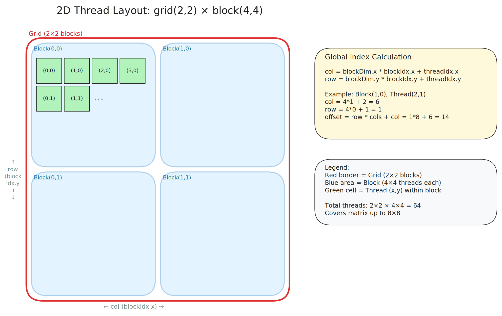

# 1. 如何将 CUDA 仓库导出 Python 包并调用

## 项目结构

将 CUDA 代码导出为 Python 包，需要以下几个组成部分：

```
csrc/              CUDA kernel 实现 (.cu 文件)
binding/           pybind11 绑定代码 (.cpp 文件)
minicuda/
  __init__.py      Python 包入口，从 _C 导出符号
setup.py           构建配置，描述如何编译和打包
```

- `csrc/` 放纯 CUDA/C++ 实现，只关心计算逻辑。
- `binding/` 放 pybind11 绑定代码，负责把 C++ 函数注册为 Python 可调用的接口。
- `minicuda/__init__.py` 是 Python 包的入口，通过 `from minicuda._C import *` 把底层 C++ 接口导出到顶层命名空间，用户直接 `from minicuda import xxx` 即可使用。

## setup.py 的作用

```python
from setuptools import setup
from torch.utils.cpp_extension import BuildExtension, CUDAExtension

setup(
    name="minicuda",
    packages=["minicuda"],
    ext_modules=[
        CUDAExtension(
            name="minicuda._C",
            sources=[...],     # csrc/*.cu + binding/*.cpp
            include_dirs=["include"],
        )
    ],
    cmdclass={"build_ext": BuildExtension},
)
```

关键组件：

- **CUDAExtension**: PyTorch 提供的 setuptools.Extension 子类，自动处理 nvcc 路径、PyTorch 头文件、pybind11 头文件、CUDA toolkit 链接库等配置。如果不用它，这些都需要手动配置。
- **BuildExtension**: 替代 setuptools 默认的编译流程，核心作用是让 `.cu` 文件走 nvcc 编译，`.cpp` 文件走 g++/clang++ 编译。
- **name="minicuda._C"**: 编译产物的模块路径。编译后生成 `minicuda/_C.cpython-xxx.so`，作为 `minicuda` 包的子模块存在。`_C` 是 PyTorch 社区的惯例命名（PyTorch 自身的 C++ 后端也叫 `torch._C`），下划线前缀表示内部实现。
- **packages=["minicuda"]**: 告诉 setuptools `minicuda/` 是一个 Python 包，需要一起安装。

## 编译过程

执行 `pip install -e .` 后，实际发生以下步骤：

### Step 1: 分文件编译

BuildExtension 按文件后缀分发到不同编译器：

```bash
# .cu 文件 -> nvcc
nvcc -c csrc/vector_add.cu -o build/vector_add.o \
     -I torch/include -I cuda/include \
     --expt-relaxed-constexpr -O2

# .cpp 文件 -> g++
g++ -c binding/bind.cpp -o build/bind.o \
    -I torch/include -I pybind11/include \
    -std=c++17 -fPIC -O2
```

每个源文件编译成一个 `.o` 目标文件。

### Step 2: 链接生成 .so

所有 `.o` 链接成一个共享库：

```bash
g++ -shared build/vector_add.o build/bind.o \
    -L torch/lib -ltorch -lc10 \
    -L cuda/lib64 -lcudart \
    -o minicuda/_C.cpython-311-x86_64-linux-gnu.so
```

这个 `.so` 是一个 Python C 扩展模块，内部通过 pybind11 注册了 Python 可调用的函数。

### Step 3: 安装 Python 包

- 开发模式 (`pip install -e .`): 在 `site-packages/` 下创建 `.egg-link` 文件指向项目目录，不拷贝文件。改代码后重新 build 即可，不需要重装。
- 正式安装 (`pip install .`): 将 `minicuda/` 和 `.so` 拷贝到 `site-packages/minicuda/`。

## 生成 .whl 分发包

```bash
pip wheel . -w dist/
```

产物是一个平台相关的 wheel 文件，因为包含编译好的 `.so`，不能跨平台使用：

```
dist/minicuda-0.0.0-cp311-cp311-linux_x86_64.whl
```

whl 本质是 zip，内容：

```
minicuda/__init__.py
minicuda/_C.cpython-311-x86_64-linux-gnu.so
minicuda-0.0.0.dist-info/METADATA
minicuda-0.0.0.dist-info/RECORD
```

## 用户调用链路

```python
from minicuda import vector_add
result = vector_add(x, y)
```

Python 解释器的完整执行过程：

```
import minicuda
  -> 找到 site-packages/minicuda/__init__.py
  -> 执行 from minicuda._C import *
    -> 找到 _C.cpython-xxx.so
    -> dlopen() 加载 .so
    -> 调用 PyInit__C() (pybind11 生成的入口函数)
    -> 注册 vector_add 等函数到 Python 命名空间
  -> vector_add 可用

vector_add(x, y)
  -> pybind11 将 torch.Tensor 转为 C++ 的 at::Tensor
  -> 调用 C++ 函数
  -> C++ 函数内部启动 CUDA kernel <<<grid, block>>>(...)
  -> GPU 执行计算
  -> 结果写回 at::Tensor, 转回 torch.Tensor 返回
```

## 与纯 CMake 方案的对比

| | setup.py + CUDAExtension | 纯 CMake |
|---|---|---|
| Python 集成 | 自动处理 pybind11 + PyTorch 链接 | 需要手动 find_package(Torch) |
| 安装方式 | `pip install -e .` 一步完成 | cmake + make，手动管理 PYTHONPATH |
| 分发 | 可以打 wheel 分发 | 不支持 pip 分发 |
| 适合场景 | 最终要从 Python 调用 | 独立 C++/CUDA 可执行文件，或需要细粒度编译控制 |

## 类型导出机制

C 扩展 `_C.so` 是二进制产物，类型检查器（pyright/mypy）和 IDE 看不懂里面的函数签名。需要手写 `.pyi` stub 文件描述接口，类型检查器的查找顺序是 `module.pyi` → `module.py` → 编译产物（被忽略）。

### 基本结构

```
minicuda/
├── __init__.py    显式 import + __all__
├── _C.pyi         描述 _C.so 的函数签名
└── _C.cpython-xxx.so   编译产物
```

`_C.pyi`:

```python
import torch
def vector_add(a: torch.Tensor, b: torch.Tensor) -> torch.Tensor: ...
```

`__init__.py`:

```python
from minicuda._C import vector_add
__all__ = ["vector_add"]
```

### 为什么不能用 `from _C import *`

类型检查器需要知道 `_C` 导出哪些符号才能展开 `*`。但 `_C.so` 是二进制不可读，`.pyi` 里如果没写 `__all__`，pyright 严格模式会拒绝展开，导致 `minicuda.vector_add` 类型变成 `Unknown`。**显式 import 一个个点名最稳**。

### 命名约束

- `.pyi` 文件名必须与所描述模块名一致（`_C.pyi` ↔ `minicuda._C` 模块）
- `_C` 这个名字来自 [setup.py](../setup.py) 中 `CUDAExtension(name="minicuda._C", ...)`，是 PyTorch/numpy/scipy 的社区惯例（`_` 表示内部实现，`C` 表示 C/C++ 后端）。改名需要 `setup.py`、`.pyi` 文件名、`__init__.py` 的 import 三处保持一致

### 拆分大型 stub

单个 `.so` 模块只能对应一个 `.pyi` 入口文件，但内容可拆到 stub-only 子目录中再 re-export：

```
minicuda/
├── _C.pyi              # 聚合入口
└── _stubs/             # 不带 __init__.py, 仅类型检查器可见
    ├── __init__.pyi
    ├── vector_ops.pyi
    └── matmul_ops.pyi
```

`_C.pyi` 只做 re-export：

```python
from minicuda._stubs.vector_ops import vector_add, vector_sub
from minicuda._stubs.matmul_ops import matmul
```

`_stubs/` 没有 `__init__.py`，运行时不存在，纯粹是给类型检查器组织代码用。

# 2. vector_add — 最简 kernel

每个 thread 处理一个元素，全局索引 `idx = blockDim.x * blockIdx.x + threadIdx.x`。grid 开到足够大，用 `if (idx < n)` 守卫边界。

关键点：
- `__global__` 函数返回值必须为 void，输出通过指针参数写入。
- `<<<grid_size, block_size>>>` 是 CUDA 独有的 kernel 启动语法，指定 grid 和 block 的尺寸。
- `block_size` 常取 256（warp 大小 32 的整数倍），`grid_size = (n + block_size - 1) / block_size` 保证覆盖所有元素。

## 内置变量速查

| 变量 | 含义 |
|---|---|
| `blockDim.x` | 一个 block 中的 thread 数 |
| `gridDim.x` | grid 中的 block 数 |
| `blockIdx.x` | 当前 block 在 grid 中的编号 |
| `threadIdx.x` | 当前 thread 在 block 中的编号 |

`Dim` = 尺寸，`Idx` = 索引。2D/3D 时还有 `.y` `.z` 分量。

# 3. saxpy — grid-stride loop

`z = a * x + y`。固定 grid 大小（如 8 blocks × 256 threads = 2048 threads），每个 thread 用循环处理多个元素：

```cuda
int idx = blockDim.x * blockIdx.x + threadIdx.x;
int stride = gridDim.x * blockDim.x;  // 总 thread 数
for (int i = idx; i < n; i += stride) {
    z[i] = a * x[i] + y[i];
}
```

关键点：
- stride = 总 thread 数 = `gridDim.x * blockDim.x`，不要和 block 数搞混。
- 好处：问题规模与 grid 大小解耦，grid 可以按 SM 数量精细调优。
- vector_add 那种"开大 grid + 每 thread 一元素"也完全正确，grid-stride loop 只是另一种策略。

# 4. matrix_add — 2D grid 与 2D block

二维矩阵逐元素加法，grid 和 block 都配置为 2D：

```cuda
dim3 block(16, 16);        // 每 block 256 threads
dim3 grid((cols + 15) / 16, (rows + 15) / 16);

int col = blockDim.x * blockIdx.x + threadIdx.x;
int row = blockDim.y * blockIdx.y + threadIdx.y;
int offset = row * cols + col;  // 行优先: 二维坐标 → 一维地址
```

关键点：
- **grid 是对计算任务的描述**：grid 的形状对应问题的形状。一维数组用 1D grid，二维矩阵用 2D grid，三维体素用 3D grid。grid/block 的配置本质上是在告诉 GPU "我的任务长什么样、怎么分配给 thread"。
- GPU 显存是一维线性的，二维索引必须手动换算为一维偏移 `row * cols + col`。
- grid 开得足够大就不需要循环，用 `if (row < rows && col < cols)` 排除越界 thread。
- `dim3` 固定三个字段 `.x .y .z`，不用的维度默认为 1。
- grid 上限极大（x 方向 2^31-1，y/z 方向 65535），正常矩阵不会越界。

## 2D thread 分布示意



# 5. rgb_to_grayscale — 多通道数据处理

将 CHW 格式的 RGB 图像转为单通道灰度图：`gray = 0.299*R + 0.587*G + 0.114*B`。

## CHW 内存布局

PyTorch 默认图像格式是 CHW（Channel-Height-Width），三个通道在内存中是**连续平面**排列：

```
内存: [R_plane (H×W)] [G_plane (H×W)] [B_plane (H×W)]
偏移: R[offset]        G[H*W + offset]  B[2*H*W + offset]
```

对于某个像素 `(i, j)`，线性偏移 `offset = i * W + j`，三通道分别在 `offset`、`H*W + offset`、`2*H*W + offset`。

## CHW vs HWC

| 格式 | 排列方式 | 使用者 |
|---|---|---|
| CHW | 同通道像素连续 | PyTorch 默认 |
| HWC | 同像素通道连续 | OpenCV、图片文件默认 |

CHW 对 GPU 更友好：同 warp 内 thread 访问同一通道的连续像素，满足 memory coalescing。HWC 下同 warp 访问的是不同通道数据，地址跨步为 3。

## Kernel 设计

每个 thread 处理一个像素，2D grid 覆盖 H×W 平面。输入 shape `(3, H, W)`，输出 shape `(H, W)`：

```cuda
int i = blockDim.x * blockIdx.x + threadIdx.x;  // row
int j = blockDim.y * blockIdx.y + threadIdx.y;  // col
int offset = i * W + j;
if (i < H && j < W) {
    out[offset] = 0.299f * inp[offset]
                + 0.587f * inp[H*W + offset]
                + 0.114f * inp[2*H*W + offset];
}
```

关键点：
- 输入必须 contiguous，否则 `data_ptr` 取出的指针不对应 CHW 平面布局。
- 边界检查用 `i < H && j < W`，不要用 `offset < H*W`（后者在越界 thread 的 j 溢出时可能误命中其他行的 offset）。
- 系数 0.299 + 0.587 + 0.114 = 1.0，纯白输入输出仍为 1.0。
