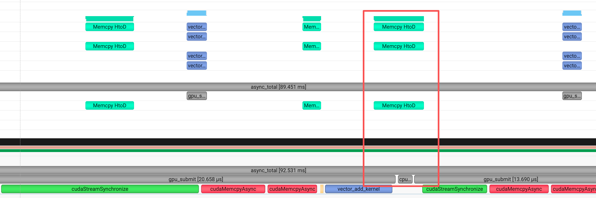
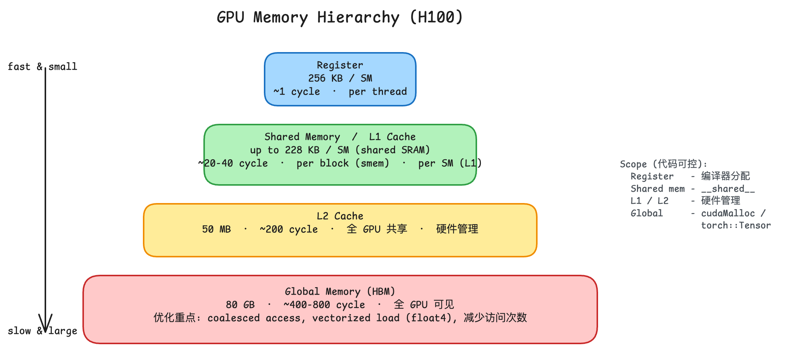
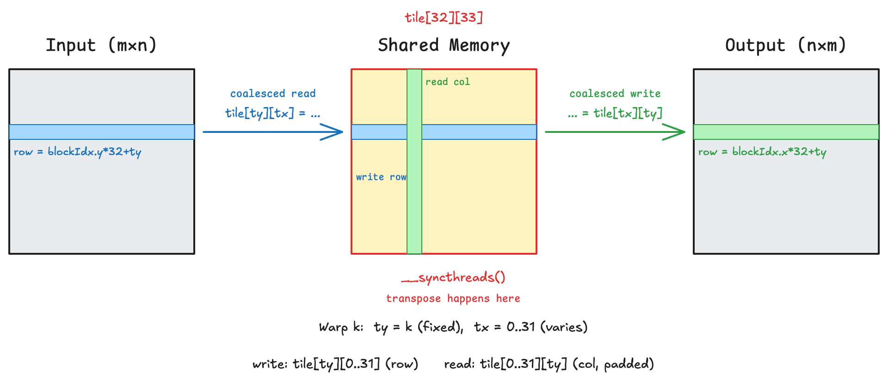

# 1. CUDA 原生显存管理与 PyTorch Tensor 互转

课程 1 全程用 PyTorch tensor 管理显存（`torch::empty`、`data_ptr`），底层细节被屏蔽。本节学习 CUDA 原生 API 自己管理显存，以及如何在原生指针和 `torch::Tensor` 之间互相转换。

## 核心 API 速查

| 函数 | 作用 |
|---|---|
| `cudaMalloc(&ptr, bytes)` | GPU 上分配显存。注意第 1 个参数是**指针的地址** (`void**`) |
| `cudaFree(ptr)` | 释放 GPU 显存 |
| `cudaMemcpy(dst, src, bytes, dir)` | 同步拷贝, dir 取 `cudaMemcpyHostToDevice` / `DeviceToHost` 等 |
| `cudaMemset(ptr, val, bytes)` | 按字节填充 (val 是 int, 通常用 0 清零) |

`cudaMalloc` 返回的指针只能在 GPU kernel 里解引用，CPU 端直接 `*ptr` 会 segfault。

## 完整流程示例

```cuda
int n = 1024;
float h_a[n] = {...};       // host 数据

float *d_a, *d_b;
cudaMalloc(&d_a, n * sizeof(float));   // 分配
cudaMalloc(&d_b, n * sizeof(float));

cudaMemcpy(d_a, h_a, n * sizeof(float), cudaMemcpyHostToDevice);  // H2D
my_kernel<<<grid, block>>>(d_a, d_b, n);
cudaMemcpy(h_a, d_b, n * sizeof(float), cudaMemcpyDeviceToHost);  // D2H

cudaFree(d_a);
cudaFree(d_b);
```

## 错误处理: CUDA_CHECK 宏

`<cuda_runtime.h>` 只提供 `cudaError_t` 和 `cudaGetErrorString`，没有 `CUDA_CHECK` 宏 — 这是社区惯例，每个项目自己定义：

```cpp
#define CUDA_CHECK(call) do {                                              \
    cudaError_t err = (call);                                              \
    if (err != cudaSuccess) {                                              \
        fprintf(stderr, "CUDA error %s at %s:%d\n",                        \
                cudaGetErrorString(err), __FILE__, __LINE__);              \
        exit(1);                                                           \
    }                                                                      \
} while (0)

CUDA_CHECK(cudaMalloc(&d_a, bytes));   // 分配失败时打印错误并退出
```

## 与 PyTorch Tensor 互转

### Tensor → 原生指针

直接用 `data_ptr<T>()`。这是个**视图**，不转移所有权：

```cpp
torch::Tensor t = torch::randn({n}, opts.device(torch::kCUDA));
float* ptr = t.data_ptr<float>();   // GPU 指针, t 析构时显存才释放
my_kernel<<<...>>>(ptr, ...);
```

### 原生指针 → Tensor (`torch::from_blob`)

把 `cudaMalloc` 出来的指针包装成 tensor：

```cpp
float* d_ptr;
cudaMalloc(&d_ptr, n * sizeof(float));
my_kernel<<<...>>>(d_ptr, ...);

auto t = torch::from_blob(
    d_ptr, {n},
    /*deleter=*/[](void* p) { cudaFree(p); },   // tensor 析构时调用
    torch::TensorOptions().dtype(torch::kFloat32).device(torch::kCUDA));
```

# 2. CPU/GPU 异步

## 场景

输入输出都在 CPU 上、GPU 只负责中间计算的操作。
> 这类场景在实际场景中并不常见，此处主主要是讲解基本思路，起学习示范作用。

本节选取的例子是矩阵加法。
> 实测发现async版本比sync版本更慢，不过起教学作用还是可以的。

## 流水线设计

每个 chunk 的完整路径包含五步：

```
regular CPU a/b → pinned CPU buffer → GPU buffer → kernel → GPU output → CPU output
       │                │                  │           │          │           │
       └─ memcpy ───────┘  cudaMemcpyAsync ┘  vector_add_kernel  cudaMemcpy   memcpy
```

其中：

- 普通 `malloc` 出来的 CPU 内存 → pinned buffer：必须用 host 端 `memcpy`，CPU 同步执行。
- pinned buffer → device buffer：`cudaMemcpyAsync` 异步发起，立即返回。
- kernel：`<<<>>>` 异步发起，立即返回。
- device buffer → CPU 输出：完整流水线最后一次性 D2H 即可。

CPU 主线程顺序执行，但提交完 `cudaMemcpyAsync` 和 kernel 后立刻返回，于是 CPU 接下来做的事（写下一个 chunk 的 pinned buffer）能与 GPU 后台正在跑的 H2D / kernel 同时进行 — 这就是要利用的异步窗口。

## 哪些地方需要同步

`cudaMemcpyAsync` 要求源/目标内存地址在 DMA 期间不被改写。所以唯一需要保护的是 host 端 pinned buffer：当前 chunk 写入这块 buffer 时，前一次以这块 buffer 为源的 H2D 必须已完成。

实现上每轮 GPU 提交前调一次 `cudaStreamSynchronize` 即可，单 stream 内其它顺序由 stream 自身保证，不需要额外同步。

## Ping-pong Buffer

如果只有一块 pinned buffer，本轮 CPU 想写 buffer 之前必须等当前 H2D 跑完，CPU 全程被卡住。

分配两块 pinned buffer 轮流使用，CPU 写 next、GPU 读 cur，每轮结束 `std::swap` 切换索引。input 和 output 各需要两块。

## 用 nsys 验证 overlap

代码中用 NVTX 标记标注 CPU 端关键步骤：

```cpp
#include <nvtx3/nvToolsExt.h>

nvtxRangePushA("cpu_memcpy");
memcpy(...);
nvtxRangePop();
```

NVTX 3 是 header-only，只 include 头文件即可，不需要链接 `.so`。

```bash
nsys profile -t nvtx,cuda,osrt --stats=true -o /tmp/profile ./prog
```

GUI 里展开主线程 → NVTX 行，可以看到 cpu_memcpy 与 CUDA HW 行上的 H2D / kernel 在同一时间段并行：



# 3. GPU 内存层级

## 各层级概览

GPU 上 thread 能访问的存储从快到慢、从小到大依次是：register、shared memory（与 L1 cache 共用 SRAM）、L2 cache、global memory (HBM)。下图给出 H100 (Hopper) 的典型参数：



| 层级 | 容量 (H100) | 延迟 | 可见性 |
|---|---|---|---|
| Register | 256 KB / SM | ~1 cycle | per thread |
| Shared memory | 最多 228 KB / SM | ~20-40 cycle | per block |
| L1 cache | 与 shared memory 共享 SRAM | ~30 cycle | per SM, 硬件管理 |
| L2 cache | 50 MB | ~200 cycle | 全 GPU, 硬件管理 |
| Global memory (HBM) | 80 GB | ~400-800 cycle | 全 GPU |

## Register

最快、每个 thread 私有。kernel 中声明的局部变量优先放 register。register 数量有限，超出后编译器会把变量"溢出"到 local memory（实际是 global memory 的一段，访问延迟高）。

编译时加 `-Xptxas -v` 可以看到每个 kernel 的 register 用量。

## Shared memory

每个 block 内的 thread 共享，典型用途：
- block 内归约：每个 thread 写一个值到 shared memory，再树形 reduce
- tile-based 数据复用：tiled GEMM 把 A / B 的 tile 加载到 shared memory，block 内 thread 共同使用
- 跨 thread 通信：配合 `__syncthreads()` 保证写入完成后再读

声明方式：

```cuda
__shared__ float tile[TILE_M][TILE_N];  // 静态分配, 大小编译期确定
extern __shared__ float buf[];           // 动态分配, kernel 启动时 <<<grid, block, smem_bytes>>>
```

## L1 / L2 cache

硬件自动管理，代码不直接控制，但访存模式会影响命中率。L1 与 shared memory 共享同一块 SRAM，部分场景可以通过 `cudaFuncSetAttribute` 调整二者比例。L2 是全 GPU 共享，受访存局部性影响明显。

## Global memory (HBM)

容量最大但延迟最高，是大部分 kernel 的瓶颈。常见优化：

- Coalesced access：同一 warp 的 32 个 thread 访问连续地址时硬件合并为 1-2 次事务
- 减少访问次数：用 shared memory / register 缓存中间结果，避免重复读
- Vectorized load：用 `float4` / `int4` 一次读 16 字节，提高带宽利用率

## 同步原语
| 同步原语 | 作用范围 | 典型场景 |
|---|---|---|
| `__syncthreads()` | block 内所有 thread | shared memory 写后读 |
| `__syncwarp(mask)` | warp 内（默认全 32 thread） | warp shuffle 后、warp 内分支汇合 |
| Cooperative groups `.sync()` | 灵活组（tile / warp / block / grid） | 现代 CUDA 推荐写法 |
| Grid-level sync | 整个 grid（需要 cooperative launch） | persistent kernel、跨 block 同步 |

## 数据放在哪里

写 kernel 时按以下顺序考虑：

1. 单 thread 内反复使用的标量、小数组 → register
2. 同 block 内多 thread 共用、有局部性的数据 → shared memory（注意 bank conflict）
3. 跨 block 共享、读多写少 → 依赖 L2 cache（保持访问模式有局部性）
4. 大块原始数据读写 → global memory，要求 coalesced

## Warp 调度与 latency hiding

SM 上同时**驻留**多个 warp，但每 cycle 只有少数 warp 在执行。以 H100 单 SM 为例：

- 4 个 warp scheduler，每 cycle 各能从一个 ready warp 发射 1 条指令 → 同时推进 4 × 32 = 128 个 thread
- 上限可驻留 64 warp（2048 thread），它们的寄存器和 shared memory 状态全部留在 SM 上不换出

执行时调度器从驻留 warp 中挑 ready 的发射指令。warp 大部分时间处于 stall 状态：

| stall 原因 | 持续时间 |
|---|---|
| Global memory load | 400-800 cycle |
| Shared memory bank conflict | 几到几十 cycle |
| 指令流水线依赖 | 4-20 cycle |
| `__syncthreads()` 等同步 | 看其他 warp 进度 |

只要 SM 上有足够多的 ready warp 可切换，访存延迟就被"用别的 warp 的计算盖住"，这就是 latency hiding。

## Occupancy

Occupancy = SM 上活跃 warp 数 / SM 上限。寄存器和 shared memory 用量决定 occupancy 上限：每 thread 用越多寄存器 → SM 能塞下的 warp 越少。

经验值：

- Memory-bound kernel：occupancy ≥ 50%（32 warp / 64），warp 多到能盖住 400+ cycle 访存延迟。
- Compute-bound kernel（Tensor Core 重计算）：occupancy 25%-50% 也够，少量 warp 就能喂饱流水线。
- 仅满足"warp 数 ≥ scheduler 数（4）"远远不够 — 因为 warp 大部分时间不可发射。

工具：

- `nvcc -Xptxas -v`：打印每个 kernel 的寄存器和 shared memory 用量
- `ncu`：报告 active warps、theoretical occupancy 等指标
- `__launch_bounds__(maxThreadsPerBlock, minBlocksPerSM)`：编译期提示，必要时让编译器 spill 寄存器以保 occupancy

## 进一步：occupancy 不是目的

Occupancy 只是手段，真正的目标是 **每 cycle scheduler 能找到足够的 ready warp 发射指令**。

```
吞吐 = 并发量 / 延迟  (Little's Law)

让 scheduler 满载有两条路:
  A. 增大 warp 数量          → 提高 occupancy
  B. 减少每个 warp 的 stall  → 提高指令级并行 (ILP)
```

两条路等价。极端例子：flash-attn / CUTLASS 用每 thread 200+ 寄存器、occupancy 只有 12.5%，但通过深度流水线、`cp.async` / TMA 异步搬运、足够 prefetch 减少了 stall，依然能跑满 SM。

实际调优用 `ncu` 看 "Warp Stall Reason" 直接定位每个 warp 在等什么，对症下药。

# 4: 矩阵转置

## Naive 实现

每个 thread 负责一个元素：从输入矩阵 `(row, col)` 读，写到输出矩阵 `(col, row)`。

矩阵按 row-major 存储，所以"按行读"是地址连续的（coalesced），"按列写"则地址跳跃大（strided）。Global memory 以 128 字节 cache line 为最小搬运粒度，warp 内 32 个 thread 各写不同 cache line 时，硬件搬 32 条 cache line 但每条只用 4 字节，带宽利用率 1/32。

反过来（按列读、按行写）也一样 — 读和写总有一个方向是 strided，无法同时 coalesced。

## Shared Memory 实现思路

核心 idea：用一块 tile 大小（如 32×32）的 shared memory 做中转，让 global memory 的读和写都变成 coalesced，把 strided 访问限制在 shared memory 上。

步骤：

1. Block 内所有 thread 协作从 global memory 按行连续读一个 tile 到 shared memory — 读 coalesced。
2. `__syncthreads()` 确保 tile 写入完成。
3. 从 shared memory 按列读（即转置后的顺序），按行连续写到输出矩阵 — 写 coalesced。

问题：步骤 3 中按列读 shared memory 会引发 bank conflict（下文解释），性能受损。

## Shared Memory 与 Bank Conflict

### Shared Memory 为什么不怕 stride

Shared memory 是片上 SRAM，硬件模型和 global memory 完全不同。它没有 cache line 的概念，不存在"搬了一大块只用一小块"的带宽浪费。它由 32 个独立的 bank 组成，只要 32 个 thread 访问不同 bank，无论地址是否连续，都是一个 cycle 同时完成。

### Bank 映射规则

按 4 字节（一个 word）粒度轮流分配到 32 个 bank：

```
word 0 → bank 0
word 1 → bank 1
...
word 31 → bank 31
word 32 → bank 0   (循环)
word 33 → bank 1
...
```

通用公式：word index 为 `i` 的数据落在 bank `i % 32`。

这种 interleaved 设计使最常见的访问模式（相邻 thread 访问相邻地址）天然无冲突。

### 什么是 Bank Conflict

一个 warp 的 32 个 thread 同时访问 shared memory 时：

- 不同 thread 访问不同 bank → 一个 cycle 完成，无冲突
- 多个 thread 访问同一 bank 的不同 word → 必须串行化，称为 N-way bank conflict
- 多个 thread 访问同一 bank 的同一 word → broadcast，无冲突（仅对读有效）

类比：32 个 bank 像 32 个图书管理员，每人管很多本书。两人找同一个管理员要同一本书 → 拿一次给两人看（broadcast）；找同一个管理员要不同的书 → 必须跑两趟（conflict）。

### 转置中为什么产生 Bank Conflict

tile 为 32×32 float，每行 32 个 word。按列读 column 0：

- thread k 读 `(k, 0)` → word index = `k * 32` → bank = `(k * 32) % 32 = 0`

32 个 thread 全落在 bank 0 的不同 word 上（不满足 broadcast 条件），产生 32-way conflict，完全串行。

## 解决方案：Padding

将 shared memory 声明为 32×33（每行多一个 padding word），每行变为 33 个 word。按列读 column 0：

- thread k 读 `(k, 0)` → word index = `k * 33` → bank = `(k * 33) % 32`

因为 33 和 32 互质（gcd = 1），`k * 33 mod 32` 在 k = 0…31 上产生 32 个不同值，32 个 thread 各落一个 bank，零冲突。

对于 bf16、fp8 等小于 4 字节的类型，bank 映射粒度不变（固定 4 字节），连续访问时多个 thread 落在同一 word 触发 broadcast（读时无冲突）。但按列读时仍存在 bank conflict，严重程度取决于行 stride 与 32 的公因数大小，padding 思路同样适用。

## 实现细节：坐标映射与数据流

### threadIdx 与矩阵坐标的关系

CUDA 中 `threadIdx.x` 是线性 ID 的最内层维度，同一 warp 内 `threadIdx.y` 固定、`threadIdx.x` = 0..31。为了让 warp 内的 global memory 访问 coalesced，必须让 `threadIdx.x` 对应矩阵的列方向（地址快变化维度）：

```
tx = threadIdx.x  →  列 (col)
ty = threadIdx.y  →  行 (row)
```

Grid 维度分配（让 `blockIdx.y` 对应行，符合"y = 垂直 = 行"的直觉）：

```
grid_size.x = ceil(n / 32)   →  blockIdx.x 枚举列方向的 tile
grid_size.y = ceil(m / 32)   →  blockIdx.y 枚举行方向的 tile
```

### 数据流



一个 warp（ty 固定，tx = 0..31）在整个流程中的行为：

1. 从 input 读一行连续的 32 个 float（coalesced），写入 tile 的同一行：

```
in_row = blockIdx.y * blockDim.y + ty
in_col = blockIdx.x * blockDim.x + tx
tile[ty][tx] = inp[in_row * n + in_col]
```

2. `__syncthreads()` — 等待 block 内所有 thread 写完 tile。

3. 从 tile 的同一列读 32 个元素（bank conflict 通过 padding 消除），写入 output 的一行连续地址（coalesced）：

```
out_row = blockIdx.x * blockDim.y + ty
out_col = blockIdx.y * blockDim.x + tx
out[out_row * m + out_col] = tile[tx][ty]
```

### 为什么输出坐标和输入坐标不同

输入 tile 位于 input 矩阵的 `(blockIdx.y, blockIdx.x)` 位置，转置后对应 output 矩阵的 `(blockIdx.x, blockIdx.y)` 位置。所以 output 的行基址从 `blockIdx.x` 算起，列基址从 `blockIdx.y` 算起——与输入恰好交换。

同时，tile 的读取索引也做了转置：写入时是 `tile[ty][tx]`，读出时是 `tile[tx][ty]`。同一个位置由不同 thread 写入和读出，这正是 shared memory 和 `__syncthreads()` 存在的意义。

# Step 5: 向量点积 — shared memory 归约

## 三级数据层级

Dot product 的计算 `sum(a[i] * b[i])` 涉及三个层级的数据：

1. Register（per thread）：每个 thread 计算自己负责的 `a[i] * b[i]`，结果暂存在寄存器中。
2. Shared memory（per block）：block 内所有 thread 把各自的乘积写入 shared memory，然后协作做树形归约，得到该 block 的部分和。
3. Global memory（全局）：各 block 的部分和通过 `atomicAdd` 累加到全局结果。

## 同步时机

| 阶段 | 操作 | 同步 |
|---|---|---|
| 各 thread 计算 `a[i]*b[i]` 写入 `buf[li]` | register → shared | `__syncthreads()` 确保所有 thread 写完 |
| 树形归约每一轮 | shared 内读写 | 每轮结束后 `__syncthreads()` 确保本轮写入对下一轮可见 |
| thread 0 累加到全局 | shared → global | `atomicAdd` 保证多 block 并发写不丢失 |

## 树形归约（以 16 个元素为例）

假设 block 内有 16 个 thread，shared memory `buf[0..15]` 初始值为各 thread 的乘积：

```
初始:   [v0  v1  v2  v3  v4  v5  v6  v7  v8  v9  v10 v11 v12 v13 v14 v15]

stride=8:  thread 0~7 活跃，各自 buf[i] += buf[i+8]
        [v0+v8  v1+v9  v2+v10  v3+v11  v4+v12  v5+v13  v6+v14  v7+v15 | ...]
        __syncthreads()

stride=4:  thread 0~3 活跃
        [v0..v12  v1..v13  v2..v14  v3..v15 | ...]
        __syncthreads()

stride=2:  thread 0~1 活跃
        [v0..v14  v1..v15 | ...]
        __syncthreads()

stride=1:  thread 0 活跃
        [v0..v15 | ...]
        __syncthreads()
```

4 轮后 `buf[0]` = 全部 16 个值之和。一般地，N 个元素需要 log2(N) 轮。

循环写法：

```
for (int stride = blockDim.x / 2; stride > 0; stride >>= 1)
{
    if (threadIdx.x < stride)
        buf[threadIdx.x] += buf[threadIdx.x + stride];
    __syncthreads();
}
```

注意 `stride >>= 1` 是除以 2，不是 `>>= 2`（除以 4）。

## 边界条件

当向量长度 n 不是 block_size 的整数倍时，最后一个 block 中部分 thread 的全局下标 `i >= n`。这些 thread 不应读 `a[i]`/`b[i]`（越界），需要在 shared memory 中填 0，确保归约时不引入垃圾值：

```
if (i < n)
    buf[li] = a[i] * b[i];
else
    buf[li] = 0.0f;
```

归约逻辑本身不需要额外判断 — 因为越界位置已填 0，加起来不影响结果。

# Step 6: GEMV — 矩阵向量乘

计算 `y = A @ x`，A 为 m×d 矩阵，x 为长度 d 的向量，输出 y 为长度 m。

## 任务划分

使用 2D block `dim3(WARP_SIZE, WARP_SIZE)` = 32×32 = 1024 个 thread：

- threadIdx.y：区分不同行。同一 threadIdx.y 的 32 个 thread（一个 warp）协作处理矩阵的同一行。
- threadIdx.x：同一 warp 内的 32 个 thread 用 stride loop 遍历该行的 d 个元素。
- blockIdx.x：1D grid，每个 block 处理 32 行（blockDim.y = 32）。

```
row_idx = blockIdx.x * blockDim.y + threadIdx.y
```

## 计算流程

1. 每个 thread 用 stride loop 累加部分乘积到 `buf[threadIdx.y][threadIdx.x]`：

```
for (int i = threadIdx.x; i < d; i += blockDim.x)
    buf[threadIdx.y][threadIdx.x] += A[d * row_idx + i] * x[i];
```

2. `__syncthreads()` 确保所有 thread 写完。

3. 树形归约沿 threadIdx.x 方向将 32 个部分和合并为一个值 `buf[threadIdx.y][0]`：

```
for (int stride = WARP_SIZE / 2; stride > 0; stride >>= 1)
{
    if (threadIdx.x < stride)
        buf[threadIdx.y][threadIdx.x] += buf[threadIdx.y][threadIdx.x + stride];
    __syncthreads();
}
```

4. threadIdx.x == 0 的 thread 写结果：`y[row_idx] = buf[threadIdx.y][0]`。

## 同步时机

| 阶段 | 同步 |
|---|---|
| buf 初始化后 | 不需要（每个 thread 只读写自己的 slot） |
| stride loop 累加完 | `__syncthreads()`（归约前保证所有部分和就位） |
| 归约每一轮 | `__syncthreads()`（本轮写入对下一轮可见） |

## 边界条件

- `row_idx >= m` 的 thread：stride loop 不执行（外层 if 守卫），buf 保持初始值 0，不影响归约。
- 写 y 时需要 `row_idx < m` 检查，避免最后一个 block 越界写。

# 7. Naive GEMM

计算 `C = A × B`，A 为 M×K，B 为 K×N，输出 C 为 M×N。

每个 thread 负责 C 的一个元素，循环 K 次从 global memory 读 A 的一行和 B 的一列，做点积：

```cuda
if (row < M && col < N) {
    float sum = 0.0f;
    for (int i = 0; i < K; i++)
        sum += A[row * K + i] * B[i * N + col];
    C[row * N + col] = sum;
}
```

性能差的原因：C 中每个元素都独立读 A 的一行和 B 的一列。同一行的 N 个输出元素共享 A 的同一行数据，但每个 thread 各自从 global memory 读一遍，产生 N 倍冗余读。B 同理有 M 倍冗余读。

GFLOPS 计算：GEMM 总计算量为 `2 * M * N * K` FLOP（每个输出元素做 K 次乘法 + K 次加法），GFLOPS = `2 * M * N * K / time_seconds / 1e9`。

# 8. Tiled GEMM — shared memory 数据复用

## 核心思路

将 A、B 沿 K 方向分成若干大小为 TILE_SIZE 的 tile。每次迭代中，block 内所有 thread 协作将 A 和 B 各一个 tile 加载到 shared memory，然后从 shared memory 读数据做计算。每个 A 元素被 TILE_SIZE 个 thread 复用（对应 B 的 TILE_SIZE 列），反之亦然。

## `__syncthreads()` 的加入时机

每次 tile 迭代需要两处同步：

```
for each tile along K:
    协作加载 A tile 和 B tile 到 shared memory
    __syncthreads()    // ① 加载完成屏障
    计算：sum += sA[ty][j] * sB[j][tx]
    __syncthreads()    // ② 计算完成屏障
```

① 保证所有 thread 的加载完成后再读取 — 否则 thread A 可能读到 thread B 还没写入的位置。

② 保证所有 thread 读取完成后再覆写 — 否则下一轮加载会覆盖慢线程还在读的数据。

两处 `__syncthreads()` 都不能放在 `if` 分支内。`__syncthreads()` 要求 block 内所有 thread 到达同一位置，如果部分线程因条件不满足而跳过，行为未定义（通常是挂死或崩溃）。

## 边界条件：A 和 B 必须独立判断

加载到 shared memory 时，A 和 B 的越界条件不能合并成一个 `if`：

```cuda
// 正确：独立判断
sA[ty][tx] = (row < M && a_col < K) ? A[row * K + a_col] : 0.0f;
sB[ty][tx] = (b_row < K && col < N) ? B[b_row * N + col] : 0.0f;

// 错误：合并判断
if (row < M && a_col < K && b_row < K && col < N) {
    sA[ty][tx] = A[...];
    sB[ty][tx] = B[...];
} else {
    sA[ty][tx] = 0; sB[ty][tx] = 0;
}
```

原因在于 shared memory 是协作加载的，一个 thread 的输出越界不等于它加载的数据不被别人使用。

以 B 为例，thread (tx, ty) 加载 `sB[ty][tx]`，但计算时 thread (tx, ty) 读的是 `sB[j][tx]`（按列读）。加载 sB 第 ty 行的 thread 和使用 sB 第 ty 行的 thread 是不同线程组 — 加载者的 col_idx 可能越界，但使用者的 col_idx 可能合法。如果用合并条件，加载者因自身越界把 sB 填 0，使用者拿到错误数据。

A 没有这个问题：sA 第 ty 行由 ty 相同的所有线程加载，也由 ty 相同的线程使用。这些线程共享同一个 row_idx — 要么全合法，要么全越界，不会出现"加载者越界但使用者合法"的情况。尽管如此，A 和 B 的条件本身就不同（A 依赖 row 和 K 维，B 依赖 K 维和 col），分开写是自然的。

写 C 的边界保护也不能省：

```cuda
if (row < M && col < N)
    C[row * N + col] = sum;
```

## 性能对比

1024×1024×1024 单精度矩阵乘法（warmup 10 次，重复 50 次取平均）：

| Kernel | 耗时 | GFLOPS | 说明 |
|---|---|---|---|
| cuBLAS | 0.057 ms | 37803.6 | 参考上限 |
| Naive | 0.421 ms | 5105.0 | 每个元素独立读 global memory |
| Tiled (TILE=32) | 0.313 ms | 6855.8 | shared memory 数据复用 |

Tiled 版本相比 naive 提升约 34%。与 cuBLAS 的差距仍然很大，后续可通过向量化访存（`float4`）、寄存器分块（register tiling）进一步缩小。

# 9. Vectorized GEMM — 向量化访存 + 寄存器分块

## Tiled GEMM 的两个瓶颈

Tiled GEMM 相比 naive 已经通过 shared memory 减少了 global memory 的重复读取，但还存在两个效率问题：

1. 搬运效率低：从 global memory 往 shared memory 搬数据时，每个 thread 一次只加载一个 float（4 字节）。GPU 的 load 指令最大支持 128 bit（16 字节），当前只用了 1/4 的搬运能力。

2. 计算密度低：每个 thread 只负责 C 的一个输出元素。每次 K 迭代中，thread 从 shared memory 读 sA 的一个值和 sB 的一个值，做 1 次乘加 — 计算/访存比仅为 1:2。shared memory 的带宽被大量低效的标量读取占满。

两个瓶颈分别对应两个优化：向量化访存解决搬运效率，寄存器分块解决计算密度。

## 向量化访存（float4）

`float4` 是 CUDA 内建的向量类型，包含 4 个 float（共 128 bit）。用 `float4` 做一次 load，硬件发一条指令搬 16 字节，相当于 4 次 float load 的数据量。

效果：搬运同样大小的 tile，load 指令数减少到 1/4，指令发射压力和访存事务数都降低。

## 寄存器分块（Register Tiling）

核心思想：让每个 thread 负责 C 的一个 TM×TN 子块（如 8×8 = 64 个元素），而不是单个元素。

每次 K 迭代中，thread 从 shared memory 读 TM 个 sA 值和 TN 个 sB 值到寄存器，然后在寄存器中做 TM×TN 次乘加。计算/访存比从 1:(TM+TN) 提升到 TM×TN:(TM+TN)。以 TM=TN=8 为例：64:16 = 4:1，比基础 tiled 版的 1:2 提升了 8 倍。

block 内的线程数也随之变化：原来一个 128×128 的输出 tile 需要 128×128 = 16384 个 thread（远超上限），现在每个 thread 算 8×8 = 64 个元素，只需要 (128/8)×(128/8) = 256 个 thread。

## 两者如何配合

以 BM=BN=128, BK=8, TM=TN=8 为例：

- Block 有 16×16 = 256 个 thread
- 每次 tile 迭代加载 A tile（128×8 = 1024 float）和 B tile（8×128 = 1024 float）
- 1024 float / 256 thread = 4 float/thread — 刚好一次 float4 load
- 每个 thread 在寄存器中维护 8×8 = 64 个累加值，遍历 BK=8 步后共做 512 次 FMA
