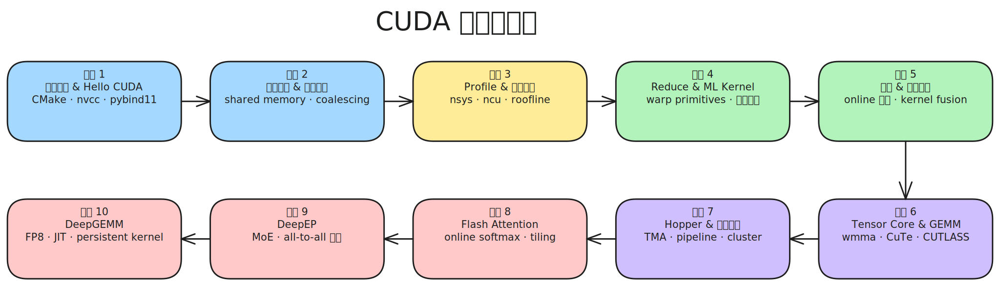

# CUDA 学习计划

以实践为核心，由易到难实现各种 kernel，逐步掌握 CUDA 编程、C++ 工程能力和性能分析方法论。

---

## 课程 1: 环境搭建 & Hello CUDA

### 学习目标

跑通从编写、编译、运行到 Python 调用的完整流程。掌握 CMake 构建 CUDA 项目的方法，理解 CUDA 编程模型中 grid/block/thread 的层级关系，能通过 pybind11 或 torch.utils.cpp_extension 将 C++/CUDA 代码导出为 Python 可调用的模块。

### 知识点

- CMake 基础：cmake_minimum_required、project、add_executable、find_package(CUDAToolkit)。
- CUDA 编译模型：.cu 文件、nvcc 编译器、host/device 代码分离。
- CUDA 编程模型：grid、block、thread 层级，<<<grid, block>>> 语法。
- GPU 内存管理：cudaMalloc、cudaMemcpy、cudaFree。
- pybind11 绑定：PYBIND11_MODULE 宏、类型转换、与 numpy 交互。
- PyTorch C++ extension：torch.utils.cpp_extension 的 setup.py 方式和 JIT load 方式。
- TORCH_LIBRARY 方式注册自定义算子（现代 PyTorch 推荐方式）。

### 实践项目

| 序号 | Kernel | 概述 | 知识点 |
|------|--------|------|--------|
| 1 | vector_add | 两个等长向量逐元素相加 | grid/block/thread 层级, <<<>>> 语法, cudaMalloc/cudaMemcpy |
| 2 | saxpy | 标量乘加运算 y = a*x + y | grid-stride loop, 处理任意长度输入 |
| 3 | matrix_add | 二维矩阵逐元素相加 | 2D grid/block 索引, 线程到矩阵坐标的映射 |
| 4 | rgb_to_grayscale | 三通道 RGB 图像转单通道灰度图 | 多通道内存布局 (HWC vs CHW), pitch memory |
| 5 | pybind_extension | 将 vector_add 封装为 Python/PyTorch 可调用模块 | pybind11 绑定, torch.utils.cpp_extension, setup.py 编写 |

### 验收标准

- 能独立编写 CMakeLists.txt 并用 nvcc 编译 CUDA 项目。
- 能用 Python 调用自己写的 CUDA kernel，结果与 PyTorch 参考实现 allclose。
- 理解 pybind11 和 torch cpp_extension 两种导出方式的区别和适用场景。

---

## 课程 2: 内存层级 & 矩阵运算

### 学习目标

理解 GPU 内存层级（global -> shared -> register），掌握 memory coalescing 和 bank conflict 的概念，能编写使用 shared memory 的 kernel。通过矩阵转置和矩阵乘法两个经典问题，体会内存访问模式对性能的决定性影响。

### 知识点

- GPU 内存层级：global memory、shared memory、register、L1/L2 cache 的容量和延迟。
- Memory coalescing（合并访存）：连续线程访问连续地址。
- Shared memory 与 bank conflict：32 bank 结构、padding 解决方案。
- 同步原语：__syncthreads() 的语义和使用时机。
- 向量化访存：float4/int4 加载以提高带宽利用率。
- GEMM 性能指标：GFLOPS 计算方法（2*M*N*K / time）。

### 实践项目

| 序号 | Kernel | 概述 | 知识点 |
|------|--------|------|--------|
| 1 | matrix_transpose_naive | 朴素矩阵转置，直接读写 global memory | 非合并访存的性能影响, 行优先 vs 列优先 |
| 2 | matrix_transpose_smem | 使用 shared memory 中转的矩阵转置 | shared memory 声明和使用, bank conflict 及 padding |
| 3 | dot_product | 两个向量的点积运算 | shared memory 实现 block 内 reduce, __syncthreads 同步 |
| 4 | gemv | 矩阵与向量相乘 | 行访问 vs 列访问模式的性能差异 |
| 5 | sgemm_naive | 最朴素的 FP32 矩阵乘 | GEMM 基本实现逻辑, GFLOPS 计算 |
| 6 | sgemm_tiled | 使用 shared memory 分块的矩阵乘 | 分块 (tiling) 算法, 数据复用, shared memory 容量约束 |
| 7 | sgemm_vectorized | 使用向量化访存的分块矩阵乘 | float4 向量化加载, 寄存器分块 |

### 验收标准

- 能清晰解释 global/shared/register 的区别和使用场景。
- matrix_transpose_smem 相比 naive 版本有明显加速，能解释原因。
- sgemm_tiled 相比 naive 版本有 5x 以上加速，能用 ncu 分析瓶颈在 compute 还是 memory。

---

## 课程 3: Profile & 性能分析

### 学习目标

掌握 nsys 和 ncu 两个核心 profiling 工具的使用方法，建立 roofline model 分析框架，能判断一个 kernel 是 compute-bound 还是 memory-bound，并据此指导优化方向。学会使用 CUDA event 和 stream 进行精确计时和异步执行。

### 知识点

- nsys（Nsight Systems）：系统级 timeline，观察 kernel launch、数据传输、CPU/GPU 交互。
- ncu（Nsight Compute）：kernel 级深度分析，SM throughput、memory throughput、occupancy、warp stall reason。
- Roofline model：理论峰值算力 vs 理论峰值带宽，arithmetic intensity 计算。
- Occupancy：active warps / max warps，block size 和 shared memory 用量的影响。
- CUDA event：cudaEventCreate/Record/ElapsedTime 精确计时。
- CUDA stream：异步执行、计算与传输重叠。

### 实践项目

| 序号 | Kernel | 概述 | 知识点 |
|------|--------|------|--------|
| 1 | bandwidth_test | 测量 global memory 实际读写带宽 | nsys 基本使用, 理论带宽 vs 实测带宽, cudaEvent 计时 |
| 2 | sgemm_profiling | 对课程 2 的多版本 SGEMM 做性能对比 | ncu 指标解读 (SM%, memory%, occupancy), roofline 分析 |
| 3 | occupancy_experiment | 同一 kernel 在不同 block size 下的性能表现 | occupancy calculator, launch configuration 调优策略 |
| 4 | stream_overlap | 用多个 CUDA stream 重叠数据传输与 kernel 计算 | cudaStream, cudaMemcpyAsync, nsys timeline 分析 |

### 验收标准

- 能用 nsys 生成 timeline 报告，识别 kernel launch overhead 和 host/device 同步瓶颈。
- 能用 ncu 分析单个 kernel，判断其 compute-bound 或 memory-bound，并给出优化建议。
- 能计算 kernel 的 arithmetic intensity 并在 roofline 图上定位。

---

## 课程 4: Reduce 模式 & ML Kernel

### 学习目标

掌握 parallel reduction 这一核心并行模式，从 naive 实现逐步优化到 warp-level shuffle。实现深度学习中最常见的算子（softmax、RMSNorm、LayerNorm、激活函数等），在此过程中深入理解 warp 原语和数值稳定性问题。

### 知识点

- Parallel reduction：树形 reduce、sequential addressing vs interleaved addressing。
- Warp 原语：__shfl_down_sync、__shfl_xor_sync、__ballot_sync、__any_sync。
- Warp divergence：同一 warp 内的分支执行代价。
- Grid-stride loop：一个 kernel 处理任意大小输入的惯用模式。
- 数值稳定性：reduce max 先行再 exp-sum（log-sum-exp 技巧）。
- 多级 reduce：block-level reduce + grid-level reduce。

### 实践项目

| 序号 | Kernel | 概述 | 知识点 |
|------|--------|------|--------|
| 1 | reduce_sum_naive | 朴素的并行求和，逐步消除常见问题 | 树形 reduce, interleaved vs sequential addressing, 线程发散 |
| 2 | reduce_sum_optimized | 使用 warp shuffle 的高效求和 | __shfl_down_sync, warp-level reduce, 多级 reduce 组合 |
| 3 | reduce_max | 并行求最大值 | reduce 算子替换 (sum->max), atomicMax 与分级 reduce 对比 |
| 4 | softmax | 数值稳定的三趟 softmax | reduce_max + reduce_sum(exp) + normalize, 数值稳定性 |
| 5 | sigmoid | sigmoid 激活函数 1/(1+exp(-x)) | 纯 elementwise kernel 编写范式, grid-stride loop |
| 6 | gelu | GELU 激活函数 | 数学内建函数 (__expf, erff), 精度 vs 速度权衡 |
| 7 | silu | SiLU/Swish 激活函数 x*sigmoid(x) | elementwise 复合运算, 函数复用 |
| 8 | rmsnorm | Root Mean Square Layer Normalization | reduce(平方和) + elementwise(归一化), 逐行独立处理 |
| 9 | layernorm | Layer Normalization (含 mean 和 variance) | 双 reduce (mean + variance), Welford 在线方差算法 |
| 10 | cross_entropy_loss | 交叉熵损失函数的前向与反向 | log-sum-exp 技巧, 前向/反向共享 reduce 结果 |

### 验收标准

- 能用 __shfl_down_sync 实现高效 warp-level reduce，理解 mask 参数含义。
- softmax、rmsnorm、layernorm 精度对齐 PyTorch（fp32 下 atol=1e-5）。
- 用 ncu 对比 reduce_sum 的 naive 和 optimized 版本，能解释性能差异来源。

---

## 课程 5: 进阶 Kernel & 融合优化

### 学习目标

掌握 online 算法在 GPU 上的应用（一趟完成原本需要多趟的操作），理解 kernel fusion 的动机和实现方法（减少 global memory 往返和 kernel launch 开销）。实现 prefix sum、topk 等经典并行算法，以及 RoPE、embedding lookup 等 LLM 常用算子。

### 知识点

- Online 算法：在线更新统计量，一趟完成（减少 global memory 读写次数）。
- Kernel fusion：多步运算合并到一个 kernel，减少 launch overhead 和中间结果写回。
- Atomic 操作：atomicAdd、atomicCAS 及其性能影响和替代方案。
- Dynamic shared memory：运行时指定 shared memory 大小。
- Parallel scan (prefix sum)：Blelloch 算法、work-efficient scan。
- Sorting on GPU：bitonic sort、radix sort 的基本思路。

### 实践项目

| 序号 | Kernel | 概述 | 知识点 |
|------|--------|------|--------|
| 1 | online_softmax | 一趟完成 max + exp-sum + normalize 的 softmax | online 算法原理, 对比三趟版本的 global memory 读写次数 |
| 2 | prefix_sum | 并行前缀和 (inclusive/exclusive scan) | Blelloch scan 算法, up-sweep/down-sweep, 多 block scan |
| 3 | histogram | 统计输入数据的值分布直方图 | atomicAdd, shared memory 原子操作优化, privatization |
| 4 | topk | 每行取 top-k 个最大元素及其索引 | bitonic sort / radix select, warp-level 排序网络 |
| 5 | rope | Rotary Position Embedding | 复数旋转运算, sin/cos 位置编码, elementwise |
| 6 | embedding_lookup | 根据索引从嵌入表中查找向量 | 不规则内存访问 (gather), cache 行为分析 |
| 7 | fused_bias_gelu | bias 加法 + GELU 激活融合为一个 kernel | kernel fusion 基本思想, 消除中间 tensor |
| 8 | fused_rmsnorm_residual | RMSNorm + residual add 融合 | 多步 reduce + elementwise 融合, 减少 global memory 往返 |
| 9 | fused_softmax_cross_entropy | softmax + 交叉熵损失融合 | online softmax 在 fusion 中的应用, 前向反向一体化 |

### 验收标准

- online_softmax 一趟版本相比三趟版本有明显性能提升，ncu 报告可验证 global memory 读写减少。
- prefix_sum 结果正确且能处理超出单 block 的大数组。
- 融合 kernel 的精度与分步实现一致，性能优于分步实现。

---

## 课程 6: Tensor Core & 高性能 GEMM

### 学习目标

理解现代 GPU 的核心算力单元 Tensor Core，从 WMMA API 入手编写 FP16 矩阵乘，逐步添加 double buffering、寄存器分块等优化。学习 CuTe 的 Layout/Tensor 抽象，理解 CUTLASS 的分层架构，最终能阅读和修改 CUTLASS 代码。

### 知识点

- Tensor Core 编程模型：wmma::fragment、load_matrix_sync/store_matrix_sync/mma_sync。
- FP16 运算：half 类型、FP16 累加 vs FP32 累加的精度差异。
- Double buffering：ping-pong 缓冲隐藏 shared memory 加载延迟。
- 寄存器 tiling：thread-level 数据复用，减少 shared memory 访问。
- CuTe：Layout（Shape + Stride）、Tensor、TiledCopy、TiledMMA 等核心抽象。
- CUTLASS 架构：Epilogue（后处理）、Mainloop（主循环）、TileIterator（数据搬运）。

### 实践项目

| 序号 | Kernel | 概述 | 知识点 |
|------|--------|------|--------|
| 1 | hgemm_wmma | 使用 WMMA API 实现 FP16 矩阵乘 | wmma fragment/load/store/mma, FP16 累加 vs FP32 累加 |
| 2 | hgemm_register_tile | 在 WMMA 基础上添加寄存器分块 | thread-level tiling, 寄存器数据复用, 寄存器压力 |
| 3 | hgemm_double_buffer | 在分块基础上添加双缓冲预取 | double buffering (ping-pong), 计算与 smem 加载重叠 |
| 4 | hgemm_cute | 用 CuTe 重写 GEMM | Layout/Tensor/Atom 抽象, TiledCopy, TiledMMA |
| 5 | cutlass_gemm_example | 直接调用 CUTLASS 3.x API 实现 GEMM | CUTLASS 分层架构, Epilogue 自定义, 编译配置 |

### 验收标准

- hgemm_wmma 精度正确（FP16 下 rtol=1e-2），性能达到 cuBLAS 的 50%+。
- 能读懂 CuTe 的 Layout 和 Tensor 抽象，能解释 make_layout 的 Shape/Stride 含义。
- 能编译和运行 CUTLASS example，理解其 Mainloop/Epilogue 的组织方式。

---

## 课程 7: Hopper 特性 & 异步执行

### 学习目标

掌握 Hopper（SM90）架构引入的关键新特性，重点是 TMA（硬件加速的异步数据搬运）和多阶段 pipeline。这些特性是 CUTLASS 3.x 和最新 CUDA 库的基础，理解它们是阅读前沿代码的前提。

### 知识点

- TMA（Tensor Memory Accelerator）：硬件自动计算地址、发起异步拷贝，无需手动计算偏移。
- TMA descriptor：CUtensorMap 的创建和配置。
- cp.async 与 TMA 的区别：Ampere 的 cp.async vs Hopper 的 TMA。
- Pipeline：多阶段 producer-consumer 流水线，barrier 同步。
- Warpgroup：4 个 warp 协作执行 wgmma 指令。
- Thread block cluster：多个 block 共享 distributed shared memory。

### 实践项目

| 序号 | Kernel | 概述 | 知识点 |
|------|--------|------|--------|
| 1 | tma_copy | 用 TMA 实现 global memory 到 shared memory 的数据搬运 | TMA descriptor 配置, CUtensorMap 创建, 异步拷贝语义 |
| 2 | hgemm_tma | 在 GEMM 中使用 TMA 替代手动数据搬运 | TMA + Tensor Core 协作, 对比手动 cp.async 版本 |
| 3 | pipeline_gemm | 多阶段流水线 GEMM，深度重叠计算与访存 | N 阶段 pipeline, barrier 同步, warpgroup 协作 |

### 验收标准

- 理解 TMA descriptor 各字段的含义，能正确配置 2D TMA。
- pipeline_gemm 性能优于非 pipeline 版本，能用 nsys 观察 pipeline 效果。
- 能解释 warpgroup 和 thread block cluster 的概念及适用场景。

---

## 课程 8: Flash Attention

### 学习目标

深入阅读 flash-attn 源码，理解 online softmax + tiling 在 attention 中的应用，复现前向和反向 kernel。理解 Flash Attention 相比标准 attention 在 IO 复杂度上的优势，以及 recomputation 在反向传播中的作用。

### 知识点

- 标准 attention 的内存瓶颈：QK^T 矩阵 O(N^2) 显存占用。
- Flash Attention 算法：online softmax + tiling，O(N) 额外内存。
- IO 复杂度分析：HBM 访问次数从 O(N^2) 降到 O(N^2 d / M)，其中 M 为 SRAM 大小。
- Flash Attention 反向：recomputation（重算 S/P 而非存储），反向 tiling 策略。
- 分块策略：外层循环遍历 KV blocks，内层循环遍历 Q blocks（前向）；反向相反。
- Causal masking 在 tiled attention 中的处理方式。

### 实践项目

| 序号 | Kernel | 概述 | 知识点 |
|------|--------|------|--------|
| 1 | multi_head_attention | 朴素多头注意力，作为 Flash Attention 的 baseline | QKV 矩阵运算, 多头并行, 标准实现的内存瓶颈 |
| 2 | flash_attn_fwd | Flash Attention 前向传播 | online softmax + tiling, O(N) 额外内存, 分块 QKV 加载 |
| 3 | flash_attn_bwd | Flash Attention 反向传播 | recomputation 策略, 反向 tiling, dQ/dK/dV 计算 |
| 4 | flash_attn_causal | 带 causal mask 的 Flash Attention | causal masking, 跳过无效 tile, mask 边界处理 |

### 验收标准

- 能向他人讲清楚 Flash Attention 的算法原理和 CUDA 实现中的关键优化。
- flash_attn_fwd 精度对齐标准 attention 实现（fp16 下 atol=1e-2），性能优于朴素实现。
- 能解释 Flash Attention 前向和反向在 tiling 顺序上的差异及原因。

---

## 课程 9: DeepEP

### 学习目标

阅读 DeepSeek 开源的 DeepEP 代码库，理解 MoE（Mixture of Experts）架构中 Expert Parallelism 的通信模式。重点理解 all-to-all 通信的 CUDA 实现、低延迟模式与高吞吐模式的设计取舍，以及 GPU-initiated RDMA 通信。

### 知识点

- MoE 架构基础：gating network、expert routing、token dispatch/combine。
- Expert Parallelism 通信模式：all-to-all 数据交换，每个 GPU 把 token 发送到对应 expert 所在的 GPU。
- 低延迟模式 vs 高吞吐模式：prefill 阶段和 decode 阶段的不同通信需求。
- GPU-initiated RDMA：绕过 CPU 的 GPU 直接网络通信。
- 通信与计算重叠：在等待 token 到达的同时执行 expert 计算。
- 负载均衡：token 在 expert 之间的不均匀分布及其对通信的影响。

### 实践项目

| 序号 | Kernel | 概述 | 知识点 |
|------|--------|------|--------|
| 1 | moe_gate_topk | MoE gating network 的 top-k 路由 | softmax + topk 选 expert, token-to-expert 映射 |
| 2 | moe_dispatch | 按路由结果将 token 分发到对应 expert | 不规则数据搬运 (scatter), permutation 构建 |
| 3 | moe_combine | 将各 expert 的输出按权重合并回原 token 顺序 | gather + weighted sum, 逆 permutation |
| 4 | all_to_all_comm | 模拟多 GPU 间的 all-to-all 数据交换 | NCCL all-to-all, 通信量分析, 通信与计算重叠 |

### 验收标准

- 能解释 DeepEP 中低延迟模式和高吞吐模式的核心设计区别。
- 理解 MoE dispatch/combine 的完整数据流（gating -> permutation -> scatter -> expert -> gather -> combine）。
- 能读懂 DeepEP 中核心 kernel 的实现逻辑。

---

## 课程 10: DeepGEMM

### 学习目标

阅读 DeepSeek 开源的 DeepGEMM 代码库，理解 FP8 GEMM 的实现细节。重点理解 FP8 数据格式、fine-grained scaling 的处理方式、JIT 编译策略，以及 persistent kernel 在 GEMM 中的应用。

### 知识点

- FP8 数据格式：E4M3（精度优先）vs E5M2（范围优先）的使用场景。
- Scaling 策略：per-tensor scaling vs per-block (fine-grained) scaling，scale factor 的计算和应用。
- JIT 编译：运行时根据矩阵尺寸和硬件参数生成最优 kernel。
- Persistent kernel：一个 kernel 处理多个 tile，减少 launch overhead，提高 SM 利用率。
- Hopper 特性在 GEMM 中的综合应用：TMA + wgmma + pipeline。
- Grouped GEMM：MoE 中多个不同大小 expert 的 GEMM 批量执行。

### 实践项目

| 序号 | Kernel | 概述 | 知识点 |
|------|--------|------|--------|
| 1 | fp8_quantize | 将 FP16/FP32 张量量化为 FP8 并计算 scale factor | E4M3/E5M2 格式, per-block scaling, 溢出处理 |
| 2 | fp8_gemm | 基础 FP8 矩阵乘（单个 GEMM） | FP8 Tensor Core (wgmma), scale 在累加中的应用 |
| 3 | fp8_gemm_persistent | 使用 persistent kernel 的 FP8 GEMM | tile scheduler, persistent loop, SM 利用率优化 |
| 4 | fp8_gemm_grouped | Grouped GEMM，批量处理多个不同大小的矩阵乘 | 不规则 workload 调度, MoE expert GEMM 场景 |

### 验收标准

- 能解释 FP8 的 E4M3 和 E5M2 格式的精度/范围差异及各自适用场景。
- 理解 DeepGEMM 中 JIT 编译的工作流程和优势。
- 能读懂 DeepGEMM 核心 kernel 的 persistent loop 和 tile scheduling 逻辑。

---

## 贯穿始终的实践习惯

1. **精度测试：** 每个 kernel 都要与 PyTorch reference 对齐，用 torch.allclose 验证。
2. **性能分析：** 用 nsys 看整体 timeline，用 ncu 看单 kernel 指标（occupancy、memory throughput、compute throughput）。
3. **版本对比：** 同一 kernel 保留 naive -> optimized 的多个版本，方便对比和回顾。
4. **写笔记：** 每个课程完成后在 notes/course-0x/ 下记录核心概念和踩过的坑。
